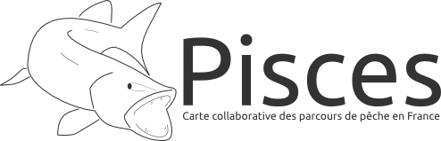

Carte collaborative des parcours de pêche en France

## Ressources

 - [Concept](resources/concept.md)

## Environnement de développement

**Nécessite**

- [Docker](https://www.docker.com/)
- [Fig](http://www.fig.sh/)

## Démarrer avec les sources

```bash
# Récupération des sources
git clone https://github.com/bornholm/pisces.git
cd pisces

# Initialisation du conteneur serveur de tiles
./scripts/reset-osm-container.sh
./scripts/download-osm-data.sh
./scripts/import-osm-data.sh

# Initialisation du conteneur de l'application Web

./scripts/install-app-deps.sh

# Lancement des conteneurs
fig up
```
